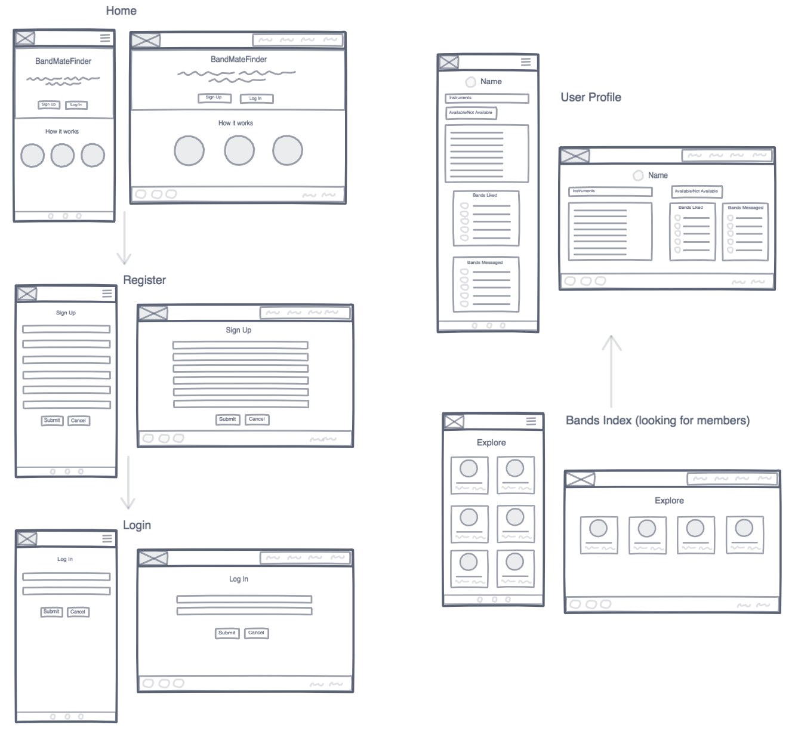
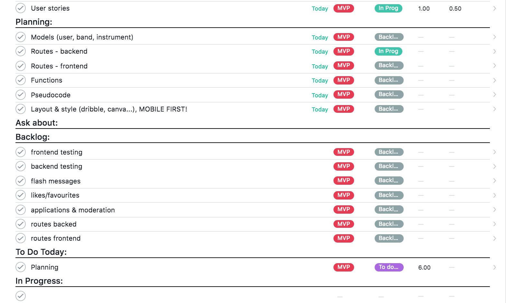
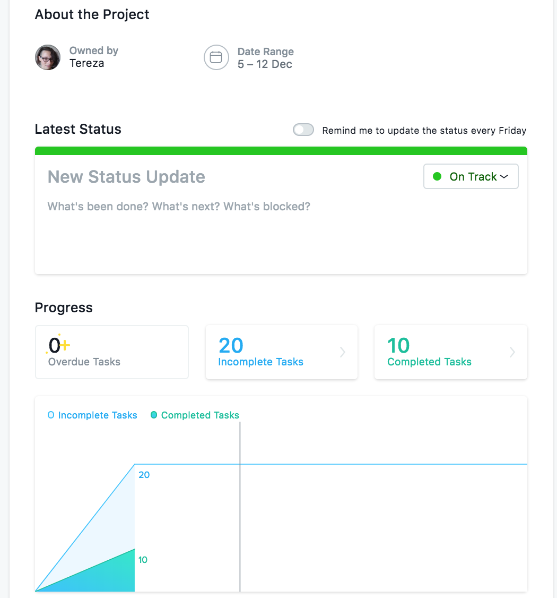
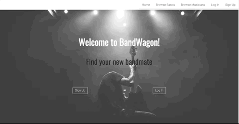
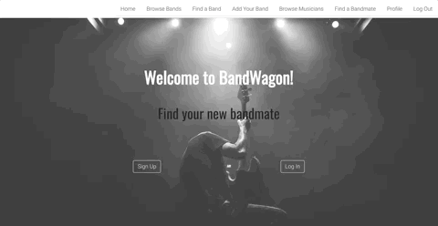
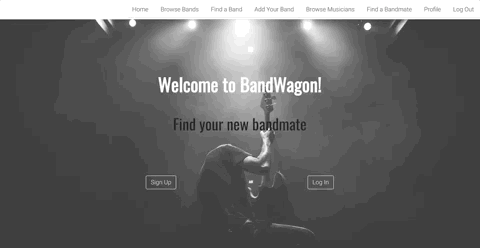

# BandWagon

#### General Assembly's Web Development Immersive: Project 4

This is a RESTful MERN single page application that I built in a week at the end of my web development course to get more practice using React.  

## Table of Contents
- [Getting Started](#getting-started)
  - [Live app](#live-version-of-the-app)
  - [Installation Instructions](#to-run-locally)
- [Description](#description)
  - [Brief](#brief)
  - [Tools and Technologies Used](#tools-and-technologies-used)
  - [Wireframes](#wireframes)
  - [Asana](#asana)
  - [Screenshots](#screenshots)
  - [Known Issues](#known-issues)
- [Challenges and Wins](#challenges-and-wins)
- [Future Work](#future-work)
- [Contact](#contact)

## Getting Started

#### [Live version of the app](https://wdi-bandwagon.herokuapp.com/)

#### To run locally

Prerequisites: MongoDB installed and `mongod` running

- clone or download repo
- install dependencies in the same directory: `yarn` (or your package manager's equivalent command)
- `yarn start:server`
- `yarn start:client`, and open `http://localhost:8000/` in your browser if it doesn't launch automatically

## Description

BandWagon allows musicians to find a band to join, and bands to find a new member. Users can register, and then find either bands, or other musicians. These results are filtered by the instrument the user is looking for. Users can add a band profile as well, if they are a part of a group looking for new members.

### Brief

The requirements were to:

- [x] **Build a full-stack application** by making your own backend and your own front-end
- [x] **Use an Express API** to serve your data from a Mongo database
- [x] **Consume your API with a separate front-end** built with React
- [x] **Be a complete product** which most likely means multiple relationships and CRUD functionality for at least a couple of models
- [x] **Implement thoughtful user stories/wireframes**
- [x] **Be deployed online** so it's publicly accessible.
- [x] **Have automated tests** for at least one RESTful resource on the back-end, and at least one classical and one functional component on the front-end.

### Tools and Technologies Used

| Back End             | Front End           | Testing    | Other    |
|----------------------|---------------------|------------|----------|
| Node.js (v11.3.0)    | React.js (v16.3.2)  | Mocha (v5.2.0) | Git |
| Express.js (v4.16.3) | JavaScript (ES6)    | Chai (v4.1.2)  | GitHub |
| MongoDB (v4.0.2)     | HTML5            | Enzyme (v3.3.0)  | Asana |
| Mongoose (v5.3.14)   | CSS3             | Sinon (v5.0.7)   | InVision |
| bcrypt (v3.0.2)       | SCSS             |                  | Insomnia |
| JSON Web Token (v8.4.0) | Bulma (v0.7.2)        |       | Heroku |

### Wireframes

I planned to make this app mobile first, but had to abandon that due to time. The desktop version of the final product turned out very similar to the original wireframes.

### Asana

For this project's task management I used Asana, which I prefer over Trello.

The task list looked like this:

Progress graph:

### Screenshots

Login page:

Adding a new band:

Search function (works in the same way on the Find a Band page):

### Known Issues

- user profile doesn't update when navigating from another musician's profile
- edit band form is not pre-populated
- any logged in user can edit and delete a band
- no toggle button on band and user profiles (to change their looking for members/bands status)
- can't get in touch with a potential band or member
- user experience needs improvement: flash messages, on form pages particularly, would be a step in the right direction  

## Challenges and Wins

This was the biggest and most complex project so far. I was excited to put my JavaScript, React and back end skills to use, learn more along the way, and I liked the concept of the app a lot. However I struggled quite a bit to translate my ideas into programming logic, spending time that I missed as the deadline was approaching. But after some re-evaluation and guidance from my instructors I reached MVP. I think this app has a lot of potential and I would love to come back to it and improve what I didn't have time for.

## Future Work 

This app could be very feature heavy, and I have excluded a lot of nice-to-haves straight from the start. If I had more time I'd love to fix the bugs and vital features that are missing, as listed above. The layout and styling, especially on the show pages, also need some more work.

Next on the list would be:
- favourite/star system, where users could "bookmark" bands or musicians they were interested in
- search results to be location dependent (ordered by distance) with maps included on show pages

## Contact

Feel free to check out my [portfolio](http://terezakinnert.com/) with more projects, or [LinkedIn profile](https://www.linkedin.com/in/terezakinnert/).
